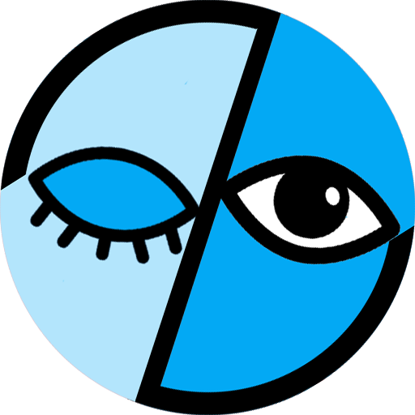
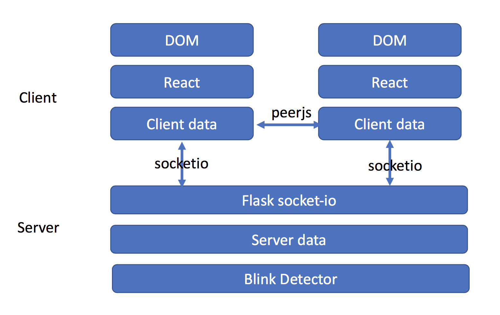
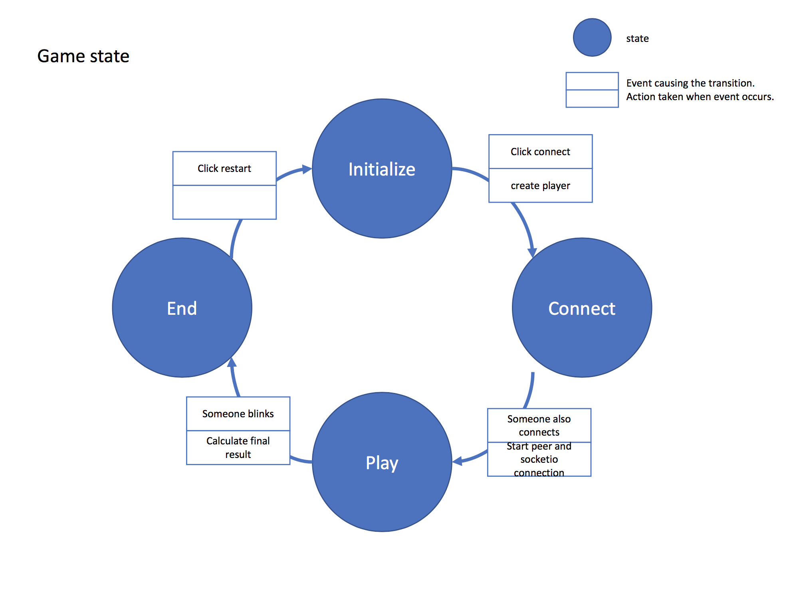

# Never-Blink

<p align="center">

</p>

## 1. 🎉 Introduction

🙌 Upvote for my [product hunt](https://www.producthunt.com/posts/never-blink)!

Randomly connect to a player around the world and challenge him/her. Remember not to blink!

For full version of demo video, click [here](https://www.youtube.com/watch?v=VCP36k5OqDs&t=59s).


## 2. 📜 Implementation

### 1. Project structure

```
.
├── backend
│   ├── __init__.py
│   ├── detect.py
│   └── shape_predictor_68_face_landmarks.dat (detect model)
├── package.json
├── requirements.txt
├── server.py
├── src
│   ├── app.jsx
│   ├── index.js
│   ├── play.jsx
│   └── start.jsx
├── static
│   └── bundle.js
├── templates
│   └── index.html
└── webpack.config.js
```

We use `react` as our frontend framework, and use `peerjs` to communicate between clients. At backend, we use `flask` to host the server. For connection between clients and server, we use `socketio` to implement real-time data transfer.



### 2. Game State

We use the notion of [Finite State Machine](https://zh.wikipedia.org/wiki/%E6%9C%89%E9%99%90%E7%8A%B6%E6%80%81%E6%9C%BA) to design our game state. The circle is the state. The text in the top of each box is the event causing state transition, and the text in the bottom of each box is the action taken when event occurs. The logic looks quite simple here, but it is not that easy to implement. For more detail you can check [play.jsx](./src/play.jsx) or [server.py](./src/server.py).



## 3. 💻 Development

I spent lots of time formatting my code and writing comments to make it as readable as possible. Hope you enjoy 😊

1. Clone this repo.

```bash
git clone git@github.com:andyh0913/blink_contest.git
```

2. Install the packages

```bash
# Frontend
npm install
# Backend
pip install -r requirements.txt
```

3. Build and Run

```bash
# Build frontend files
npm run build
# Run server
npm run start
```

Every time you changed your code, you should run the above command again. We do not support hot module replacement now.

4. Start and Enjoy

Goto `https://0.0.0.0:3000`

`0.0.0.0:3000` does not work, remember to add `https`.

## 4. 🚧 Problem

1. Because the detector is too slow and weak, we can not endure too many clients. Therefore, we do not deploy it to a public server now. We plan to train a robust and fast model in the future.
2. When restarting, the old media connection listener will be called again. So we remove restart temporarily.

## 5. 📖 Reference

1. Environment setup: https://github.com/rwieruch/minimal-react-webpack-babel-setup
2. Simple P2P WebRTC package: https://github.com/peers/peerjs
3. Socket-io: https://socket.io/docs/client-api/
4. Flask-socketio: https://flask-socketio.readthedocs.io/en/latest/
5. Blink detector: https://github.com/dilawar/eye-blink-detector
6. Material UI: https://material-ui.com/

## 6. 🗞️ License

[MIT Licensed](./License)
